# Hotel Booking Analysis

## Business Problem & Task Instructions

This project aims to analyze hotel booking data to uncover key business insights and provide actionable recommendations.

### Key Objectives:
1. Identify meaningful trends and patterns in booking data
2. Analyze booking variations across channels, room types, and star ratings
3. Understand cancellation behavior and influencing factors
4. Perform root cause analysis for observed patterns
5. Provide data-driven business recommendations to improve performance

---

## Dataset Overview

The dataset consists of hotel booking transactions from an online travel platform, capturing customer behavior, property characteristics, pricing, and transaction outcomes.

It includes key dimensions such as:
- Customer & Property: customer_id, property_id, city, star_rating
- Booking Details: booking_date, check-in/check-out, room_type
- Channel Information: booking_channel
- Pricing & Revenue: booking_value, cost_price, selling_price
- Transaction Details: payment_method, cashback, coupon usage
- Cancellation Data: booking_status, refund_status

This dataset enables analysis of booking trends, customer preferences, pricing strategies, and cancellation behavior.

---

## Objective

The objective of this analysis is to:
- Understand customer booking behavior
- Evaluate channel performance
- Analyze pricing and revenue trends
- Identify factors influencing cancellations
- Provide recommendations to improve profitability and retention

---

## Key Observations & Insights

### 1. Booking Channel Analysis
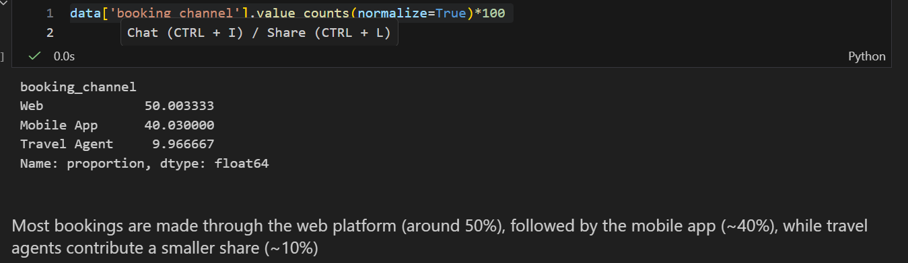

- Web channel contributes the highest share (~50%), followed by Mobile App (~40%)
- Travel Agents contribute the least (~10%)
- Direct channels are dominant and more reliable

---

### 2. Room Type Analysis
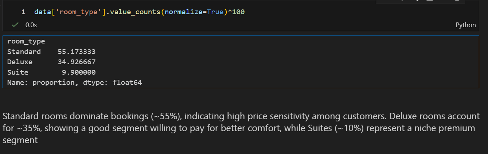

- Standard rooms dominate bookings (~55%)
- Deluxe rooms (~35%) indicate willingness to pay for comfort
- Suites (~10%) represent a niche premium segment

---

### 3. Star Rating Analysis
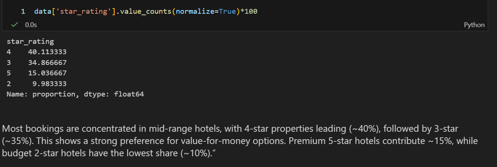

- Majority bookings in 3–4 star hotels
- Indicates strong preference for value-for-money options
- 5-star hotels have lower but premium demand

---

### 4. Monthly Booking Trend
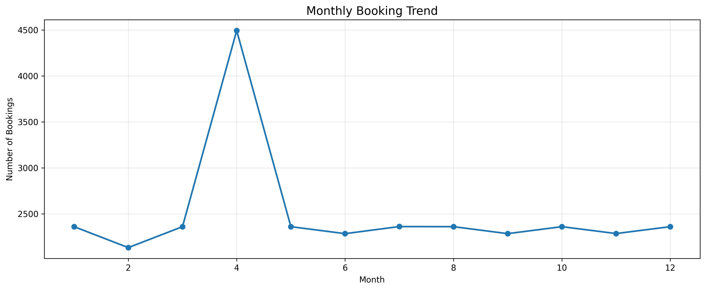

- Peak observed in April indicating strong seasonal demand
- Stable trends across other months

---

### 5. Monthly Revenue Trend
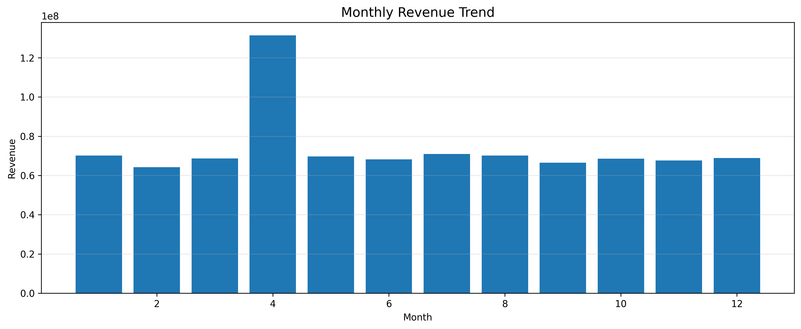

- Revenue aligns closely with booking trends
- Indicates consistent pricing strategy

---

### 6. Monthly Cancellation Rate
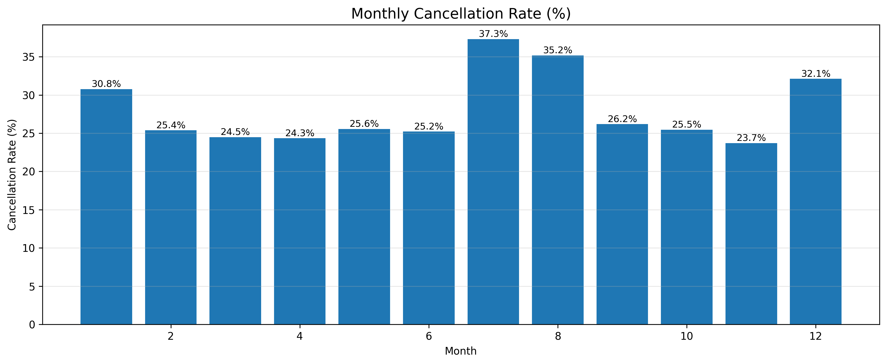

- Highest cancellations in July (~37%) and August (~35%)
- Seasonal uncertainty drives cancellations

---

### 7. Booking Channel vs Room Type
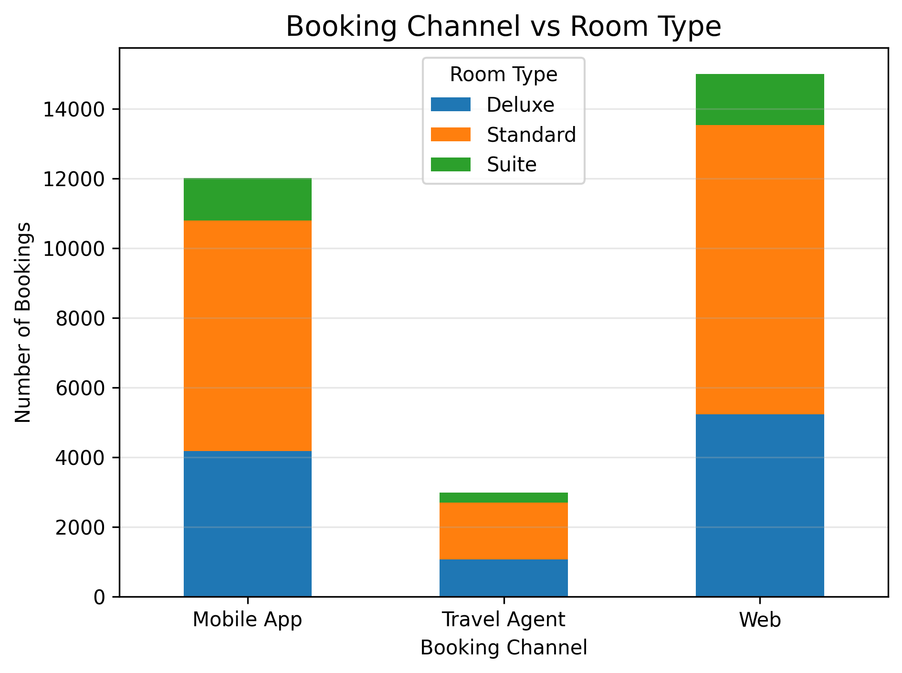

- Web dominates across all room types
- Travel agents contribute least

---

### 8. Booking Channel vs Star Rating
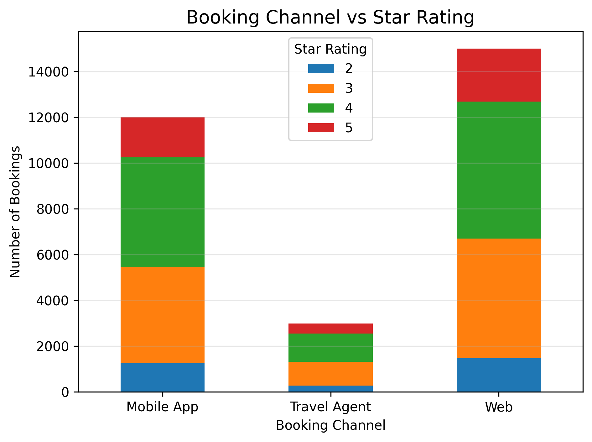

- Mid-range hotels dominate across all channels
- Strong demand for affordable luxury

---

### 9. Cancellation Rate by Room Type
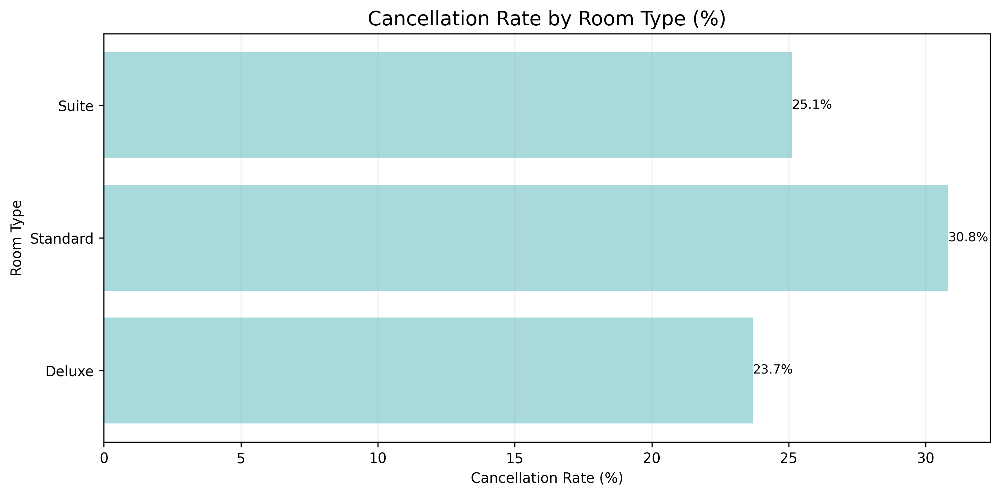

- Standard rooms have highest cancellations (~31%)
- Deluxe rooms are more stable

---

### 10. Cancellation Rate by Booking Channel
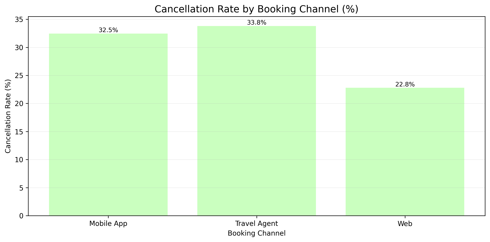

- Travel Agents have highest cancellations (~34%)
- Web channel is most reliable (~23%)

---

### 11. Cancellation Rate by Lead Time
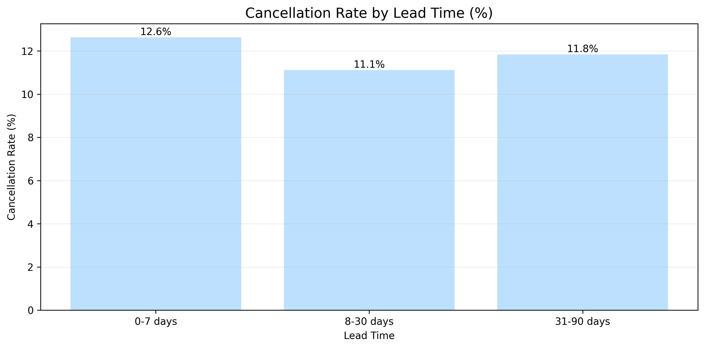

- Higher cancellations at early and last-minute bookings
- Mid-range lead times are more stable

---

## Root Cause Analysis

### 1. High Cancellation in Certain Months
- Peak cancellations in July, August, and December due to holiday flexibility
- Customers tend to rebook better deals during high-demand periods
- Longer lead times increase cancellation probability

---

### 2. Channel & Property Performance

#### Booking Channels
- Web channel: Highest revenue, lowest cancellations → most efficient
- Travel Agents: High cancellations due to pricing and lower trust

#### Room Type
- Standard rooms: High demand but high cancellations
- Deluxe rooms: Balanced demand and stability

#### Star Rating
- 3–4 star hotels perform best due to value-for-money positioning
- Premium customers (5-star) show more flexible behavior

---

### 3. Seasonal Trends

- Strong seasonality observed in cancellations and bookings
- Peak seasons → higher uncertainty and cancellations
- Average stay duration remains stable across months

---

## Business Recommendations

### 1. Strategies to Reduce Cancellations
- Implement stricter cancellation policies during high-risk periods
- Offer discounts for non-refundable bookings
- Target high-cancellation segments (Standard rooms, Travel Agents)
- Use reminders and incentives for long lead-time bookings

---

### 2. Improve Profitability & Increase Repeat Bookings
- Focus on mid-range segments (3–4 star, Deluxe rooms)
- Promote direct channels (Web/App)
- Introduce loyalty programs and personalized offers
- Upsell customers to higher-value room types

---

### 3. Optimize Pricing, Promotions & Channel Strategy
- Implement dynamic pricing based on demand
- Offer targeted promotions during high-cancellation periods
- Adjust pricing for price-sensitive segments
- Strengthen direct booking platforms (UX + exclusive deals)
- Reduce dependency on travel agents

---

## Conclusion

This analysis highlights key behavioral patterns, channel performance, and pricing dynamics impacting hotel bookings.

By leveraging these insights, businesses can:
- Reduce cancellations
- Improve customer retention
- Optimize pricing strategies
- Maximize overall revenue

---

## Author

Mahak Bisht  
Aspiring Data Analyst | Python | SQL | Power BI  